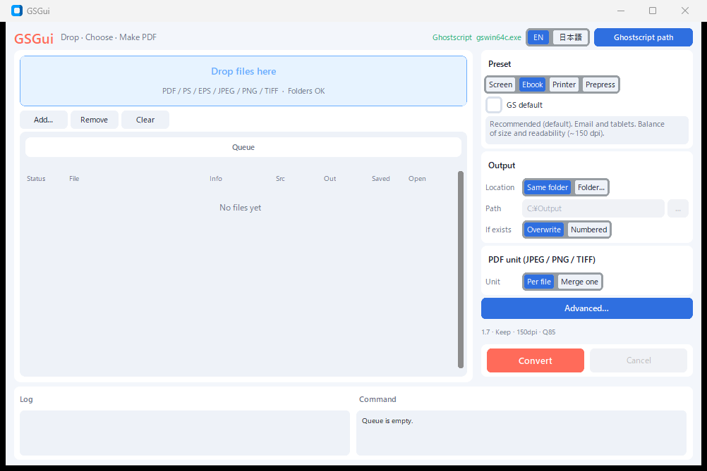

# GSGui

**[English](README.md)** | **[日本語](README.ja.md)**

Ghostscript を使った **Windows 向け PDF 変換 GUI** です。  
PDF / PostScript / 画像をドロップし、プリセットと少数の詳細設定で PDF を再出力・変換します。

Ghostscript 本体は同梱しません。システムに入っている `gswin64c.exe` を呼び出します。



## ダウンロード（実行ファイル）

[Releases](https://github.com/miyam1974/GSGui/releases) から最新の **`GSGui-windows-x64.exe`** をダウンロードしてください。

- Python のインストールは不要です
- **Ghostscript は別途インストールが必要**です（下表参照）
- Windows が「不明な発行元」と表示する場合があります（未署名のため）

`v*` タグを push すると、GitHub Actions がビルドして Release に exe を添付します。

## 主な機能

- 入力キュー（ドラッグ＆ドロップ / 追加 / 削除 / クリア）。フォルダドロップ可
- 対応形式: PDF、PS、EPS、JPEG、PNG、TIFF
- 出力先（元と同じフォルダ、または指定フォルダ）。ファイル名は `元の名前_gs.pdf`
- 同名時の扱い: 上書き / 連番
- 変換: PDF 再出力、PS/EPS → PDF、画像 → PDF（ファイルごと / まとめて1つ）
- 画質プリセット: 画面 / 電子書籍（初期値） / プリンタ / 印刷入稿 / GS既定
- 詳細設定: PDF 互換、色、解像度、JPEG 品質、ページ範囲、画像の用紙・向き
- 一括変換、進行状況、中断、結果表示とログ、実行コマンドのプレビュー
- Ghostscript の自動検出。見つからない場合は右上の **「Ghostscriptパス設定」** で指定
- UI 言語: ヘッダーの **EN**（初期値）/ **日本語** トグル
- ウィンドウ位置や変換設定の保存（`%USERPROFILE%\.gsgui\settings.json`）

## 必要環境

| 項目 | 内容 |
|------|------|
| OS | Windows 10 / 11 |
| Ghostscript | [公式サイト](https://www.ghostscript.com/) から別途インストール（64-bit の `gswin64c.exe`） |
| ソースから動かす場合 | Python 3.11 以降（開発・動作確認は 3.13）と `requirements.txt` の依存 |

### Ghostscript が見つからないとき

1. Ghostscript をインストールする  
2. それでも検出されない場合は、アプリ右上の **「Ghostscriptパス設定」** から `gswin64c.exe` を選ぶ

## 使い方

1. PDF / PS / EPS / JPEG / PNG / TIFF をウィンドウへドロップする（または **「追加…」**）
2. 右側でプリセット・出力先・同名時の扱いを選ぶ（必要なら **「詳細設定…」**）
3. **「変換する」** を押す
4. キュー行末の 📁 / 📄 から出力フォルダや PDF を開く

## ソースから起動

```powershell
git clone https://github.com/miyam1974/GSGui.git
cd GSGui
python -m venv .venv
.\.venv\Scripts\Activate.ps1
pip install -r requirements.txt
python -m gsgui
```

初回以降は `run.bat` でも起動できます（venv がなければ自動作成します）。

## 開発

```powershell
.\.venv\Scripts\Activate.ps1
pip install -r requirements.txt pytest
python -m pytest tests -q
```

### ローカルで exe をビルド

```powershell
pip install -r requirements.txt -r requirements-build.txt
.\scripts\build_exe.ps1
```

成果物: `dist\GSGui-windows-x64.exe`

### Release を切る（メンテナ）

```powershell
git tag v0.1.0
git push origin v0.1.0
```

Actions の **Release** ワークフローが Windows 上でビルドし、GitHub Release に exe を添付します。

## スコープ外

サムネイル、PDF/A、ページ編集・注釈・OCR、パスワード解除、シェル連携、変換履歴など。  
Ghostscript の対話的なフロントエンドに寄せたツールです。

## ライセンス

本リポジトリのソースコードは [MIT License](LICENSE) です。

実行に必要な [Ghostscript](https://www.ghostscript.com/) は本プロジェクトの一部ではなく、Artifex のライセンス（AGPL など）が別途適用されます。利用・再配布時は Ghostscript 側の条件も確認してください。
